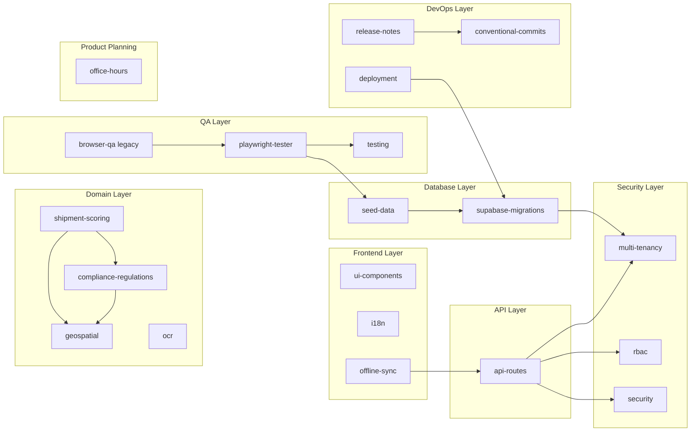

# OriginTrace — Agent Skills Registry

> **Purpose:** Centralized catalogue of every agent skill available in this workspace.
> Agents read this document to determine which skill(s) to activate for a given task.
> If a task matches multiple skills, activate **all** that apply — they are composable.

---

## Quick Reference

| # | Skill | Category | Trigger Keywords |
|---|-------|----------|-----------------|
| 1 | [api-routes](#1-api-routes) | Backend | `API endpoint`, `route handler`, `app/api`, `POST handler`, `GET handler`, `withErrorHandling`, `tier guard`, `rate limit` |
| 2 | [playwright-tester](#2-playwright-tester) | QA & Testing | `smoke test`, `QA sweep`, `full sweep`, `test from browser`, `verify UI`, `regression test`, `find bugs`, `check the app in a browser`, `run my tests` |
| legacy | [browser-qa](#legacy-browser-qa) | QA & Testing | explicit `use browser-qa`, `run the browser agent`, `operations registry update`, `Operations_ai.md` |
| 3 | [compliance-regulations](#3-compliance-regulations) | Domain | `EUDR`, `DDS`, `pedigree certificate`, `FSMA 204`, `Lacey Act`, `UK Environment Act`, `halal`, `China Green Trade`, `DPP` |
| 4 | [conventional-commits](#4-conventional-commits) | DevOps | `git add`, `commit my changes`, `save this work`, `version control` |
| 5 | [deployment](#5-deployment) | DevOps | `deploy`, `production`, `Vercel`, `environment variables`, `service worker`, `PWA manifest`, `go live` |
| 6 | [geospatial](#6-geospatial) | Domain | `farm boundary`, `polygon`, `GeoJSON`, `Leaflet`, `PostGIS`, `map`, `coordinates`, `spatial conflict`, `deforestation overlay` |
| 7 | [i18n](#7-i18n) | Frontend | `translation`, `i18n`, `locale`, `next-intl`, `RTL`, `language switcher`, `French`, `Arabic` |
| 8 | [multi-tenancy](#8-multi-tenancy) | Security | `multi-tenant`, `org_id`, `tenant isolation`, `RLS policy`, `superadmin`, `cross-tenant`, `data isolation` |
| 9 | [ocr](#9-ocr) | Domain | `NIN`, `voter card`, `OCR`, `ID scanning`, `identity document`, `OpenAI vision` |
| 10 | [offline-sync](#10-offline-sync) | Infrastructure | `offline`, `IndexedDB`, `sync queue`, `service worker`, `PWA`, `background sync`, `cache warmer` |
| 11 | [rbac](#11-rbac) | Security | `permission`, `role`, `access control`, `gate a page`, `admin only`, `RBAC`, `requireRole`, `buyer portal`, `farmer portal` |
| 12 | [release-notes](#12-release-notes) | DevOps | `release notes`, `changelog`, `what changed`, `summarize my work`, `README update` |
| 13 | [security](#13-security) | Security | `security audit`, `harden API`, `fix RLS`, `tenant isolation`, `API authentication`, `audit logs`, `sanitise errors` |
| 14 | [seed-data](#14-seed-data) | Database | `seed the database`, `demo tenant`, `reset local data`, `seed-demo`, `seed-gacon`, `test data setup` |
| 15 | [shipment-scoring](#15-shipment-scoring) | Domain | `readiness decision`, `scoring engine`, `regulatory framework`, `risk flag`, `compliance score`, `remediation` |
| 16 | [supabase-migrations](#16-supabase-migrations) | Database | `add a column`, `new table`, `migration file`, `RLS policy`, `schema change`, `database update`, `Supabase SQL` |
| 17 | [testing](#17-testing) | QA & Testing | `write a test`, `unit test`, `E2E test`, `Playwright`, `Vitest`, `test coverage`, `run the test suite` |
| 18 | [ui-components](#18-ui-components) | Frontend | `add a component`, `shadcn`, `UI component`, `Tailwind class`, `white-label`, `theming`, `design system` |
| 19 | [office-hours](#19-office-hours) | Product | `brainstorm this`, `is this worth building`, `help me think through`, `office hours`, `I have an idea` |

### General-Purpose Skills (from `skills-main`)

| # | Skill | Category | Trigger Keywords |
|---|-------|----------|-----------------|
| 20 | [pdf](#20-pdf) | Documents | `.pdf`, `create PDF`, `merge PDF`, `split PDF`, `OCR PDF`, `watermark` |
| 21 | [docx](#21-docx) | Documents | `.docx`, `Word doc`, `table of contents`, `headings`, `letterhead` |
| 22 | [pptx](#22-pptx) | Documents | `.pptx`, `slides`, `presentation`, `pitch deck`, `speaker notes` |
| 23 | [xlsx](#23-xlsx) | Documents | `.xlsx`, `.csv`, `spreadsheet`, `Excel`, `tabular data`, `charts` |
| 24 | [canvas-design](#24-canvas-design) | Creative | `poster`, `visual design`, `artwork`, `.png`, `.pdf design` |
| 25 | [algorithmic-art](#25-algorithmic-art) | Creative | `generative art`, `p5.js`, `flow field`, `particle system`, `algorithmic art` |
| 26 | [frontend-design](#26-frontend-design) | Frontend | `landing page`, `web component`, `UI design`, `beautify`, `dashboard layout` |
| 27 | [web-artifacts-builder](#27-web-artifacts-builder) | Frontend | `HTML artifact`, `React artifact`, `multi-component`, `shadcn artifact` |
| 28 | [claude-api](#28-claude-api) | Integration | `Anthropic SDK`, `Claude API`, `prompt caching`, `tool use`, `model migration` |
| 29 | [mcp-builder](#29-mcp-builder) | Integration | `MCP server`, `Model Context Protocol`, `tool integration`, `FastMCP` |
| 30 | [skill-creator](#30-skill-creator) | Meta | `create a skill`, `edit skill`, `skill evals`, `optimize skill` |
| 31 | [doc-coauthoring](#31-doc-coauthoring) | Documents | `write docs`, `technical spec`, `proposal`, `decision doc` |
| 32 | [slack-gif-creator](#32-slack-gif-creator) | Creative | `animated GIF`, `Slack GIF`, `make a GIF` |
| 33 | [brand-guidelines](#33-brand-guidelines) | Creative | `brand colors`, `style guidelines`, `visual formatting`, `Anthropic look` |
| 34 | [theme-factory](#34-theme-factory) | Creative | `theme`, `styling artifact`, `color palette`, `apply theme` |
| 35 | [internal-comms](#35-internal-comms) | Documents | `status report`, `leadership update`, `newsletter`, `incident report` |
| 36 | [webapp-testing](#36-webapp-testing) | QA & Testing | `Playwright`, `browser screenshot`, `UI debugging`, `browser logs`, `local web app` |

---

## Skill Dependency Graph

---

## Detailed Skill Profiles

### 1. api-routes
- **Path:** `.agents/skills/api-routes/SKILL.md`
- **Purpose:** Codifies the standard pattern for all 75+ Next.js API route handlers: Auth → RBAC → Validation → Business Logic → Standardized Response.
- **Key files:** `lib/api/errors.ts`, `lib/api/tier-guard.ts`, `lib/api/rate-limit.ts`, `lib/api-auth.ts`
- **Depends on:** `multi-tenancy`, `rbac`, `security`

---

### 2. playwright-tester
- **Path:** `.agents/skills/playwright-tester/SKILL.md`
- **Purpose:** Default browser QA workflow. Writes persistent Playwright `.spec.ts` tests, runs them with `npx playwright test --reporter=line`, and uses Playwright's native runner instead of token-heavy browser-agent sessions.
- **Key files:** `playwright.config.ts`, `tests/e2e/*.spec.ts`, `tests/e2e/auth.setup.ts`
- **Depends on:** `seed-data`, `testing`

---

### Legacy. browser-qa
- **Path:** `.agents/skills/browser-qa/SKILL.md`
- **Purpose:** Legacy/fallback registry workflow. Use only when the user explicitly asks for `browser-qa`, asks to run the browser agent, or specifically needs `Operations_ai.md` reconciled from QA results.
- **Key files:** `Operations_ai.md`
- **Default:** Prefer `playwright-tester` for smoke tests, regression checks, full sweeps, UI verification, and browser bug finding.

---

### 3. compliance-regulations
- **Path:** `.agents/skills/compliance-regulations/SKILL.md`
- **Purpose:** Deep regulatory context for EUDR, FSMA 204, UK Environment Act, Lacey Act, China Green Trade, UAE Halal, and buyer-specific compliance profiles.
- **Key files:** `lib/compliance/dds-types.ts`, `lib/compliance/pedigree-certificate.ts`, `lib/services/scoring/*.ts`
- **Depends on:** `geospatial`, `shipment-scoring`

---

### 4. conventional-commits
- **Path:** `.agents/skills/conventional-commits/SKILL.md`
- **Purpose:** Atomic, structured Git commits using Conventional Commits spec. Provides OriginTrace-specific scopes (`scoring`, `compliance`, `geo`, `sync`, `rbac`, `ui`, `api`, `db`, `i18n`, `deploy`).
- **Key files:** N/A (git workflow)

---

### 5. deployment
- **Path:** `.agents/skills/deployment/SKILL.md`
- **Purpose:** Pre-deploy checklist for Vercel/Replit deployments. Covers env vars, Supabase config, PWA service worker regeneration, and rollback procedures.
- **Targets:** Vercel (prod/staging), Replit (demo), localhost (dev)
- **Depends on:** `supabase-migrations`

---

### 6. geospatial
- **Path:** `.agents/skills/geospatial/SKILL.md`
- **Purpose:** Farm boundary mapping with PostGIS + Leaflet. Covers GeoJSON conventions, spatial conflict detection, boundary authenticity scoring, and the WGS84 coordinate system.
- **Key files:** `lib/geometry/polygon.ts`, `lib/services/boundary-analysis.ts`, `components/farm-polygon-map.tsx`

---

### 7. i18n
- **Path:** `.agents/skills/i18n/SKILL.md`
- **Purpose:** Internationalisation via `next-intl`. Supports English, French, and Arabic (RTL). Enforces no hardcoded user-facing strings.
- **Key files:** `messages/en.json`, `messages/fr.json`, `messages/ar.json`, `components/locale-switcher.tsx`

---

### 8. multi-tenancy
- **Path:** `.agents/skills/multi-tenancy/SKILL.md`
- **Purpose:** Strict `org_id`-based tenant isolation. Provides RLS policy templates, superadmin bypass patterns, and the golden rule: "If a table holds org data, it has `org_id + RLS`."
- **Key files:** `lib/supabase/admin.ts`, `lib/admin/create-tenant.ts`

---

### 9. ocr
- **Path:** `.agents/skills/ocr/SKILL.md`
- **Purpose:** AI-powered identity document scanning (NIN, Voter Card, Passport) using OpenAI GPT-4o Vision. Reduces manual entry errors during field farmer registration.
- **Key files:** `components/ocr-capture.tsx`, `lib/services/ocr-extractor.ts`

---

### 10. offline-sync
- **Path:** `.agents/skills/offline-sync/SKILL.md`
- **Purpose:** Offline-first architecture for field agents. IndexedDB (Dexie.js) stores sync queue + offline cache; data syncs to Supabase when connectivity returns.
- **Key files:** `lib/offline/sync-store.ts`, `lib/offline/sync-service.ts`, `components/cache-warmer.tsx`, `components/offline-indicator.tsx`

---

### 11. rbac
- **Path:** `.agents/skills/rbac/SKILL.md`
- **Purpose:** Single source of truth for role-based access. Defines 10 roles (superadmin → farmer), route permissions, and the `requireRole` / `hasAccess` API.
- **Key files:** `lib/rbac.ts`, `middleware.ts`
- **Roles:** `superadmin`, `admin`, `aggregator`, `agent`, `quality_manager`, `logistics_coordinator`, `compliance_officer`, `warehouse_supervisor`, `buyer`, `farmer`

---

### 12. release-notes
- **Path:** `.agents/skills/release-notes/SKILL.md`
- **Purpose:** Translates technical commit logs into user-facing "What's New" / "Fixes" / "Improvements" release notes.
- **Depends on:** `conventional-commits`

---

### 13. security
- **Path:** `.agents/skills/security/SKILL.md`
- **Purpose:** "Secure by Default" enforcement across five pillars: Multi-Tenant Isolation, RBAC, Tier Gating, Audit Logging, and Sanitized Error Handling.
- **Key files:** `lib/audit.ts`, `lib/superadmin-audit.ts`, `lib/api/errors.ts`, `lib/api/tier-guard.ts`
- **Depends on:** `multi-tenancy`, `rbac`

---

### 14. seed-data
- **Path:** `.agents/skills/seed-data/SKILL.md`
- **Purpose:** Demo tenant seeding with realistic data. Documents the tenant anatomy (org → users → farms → suppliers → shipments → certificates → scores) and reset workflow.
- **Key files:** `scripts/seed-demo.ts`, `scripts/seed-gacon.ts`, `scripts/seed-locations.ts`, `scripts/reset-and-seed.sh`
- **Depends on:** `supabase-migrations`

---

### 15. shipment-scoring
- **Path:** `.agents/skills/shipment-scoring/SKILL.md`
- **Purpose:** Multi-regulatory shipment readiness engine. Evaluates 5 scoring dimensions across 7 regulatory frameworks to produce a `ReadinessDecision` (`go` | `conditional` | `no_go` | `pending`).
- **Key files:** `lib/services/scoring/index.ts`, `lib/services/scoring/constants.ts`, `lib/services/scoring/types.ts`
- **Depends on:** `compliance-regulations`, `geospatial`

---

### 16. supabase-migrations
- **Path:** `.agents/skills/supabase-migrations/SKILL.md`
- **Purpose:** Timestamped SQL migration workflow. All schema changes go through `supabase/migrations/` and are reflected in `supabase/schema.sql`.
- **Key files:** `supabase/schema.sql`, `supabase/migrations/*.sql`, `supabase/rls-policies.sql`
- **Depends on:** `multi-tenancy` (for RLS patterns)

---

### 17. testing
- **Path:** `.agents/skills/testing/SKILL.md`
- **Purpose:** Vitest unit tests + Playwright E2E tests. Covers file organization, auth bootstrapping, fixture patterns, and naming conventions.
- **Key files:** `tests/unit/*.test.ts`, `tests/e2e/*.spec.ts`, `tests/e2e/auth.setup.ts`, `tests/fixtures/`

---

### 18. ui-components
- **Path:** `.agents/skills/ui-components/SKILL.md`
- **Purpose:** Design system built on shadcn/ui + Tailwind CSS. Enforces semantic tokens over hardcoded colours, white-label theming via CSS custom properties, and accessibility standards.
- **Key files:** `components/ui/`, `components/tenant-theme-provider.tsx`, `app/globals.css`

---

### 19. office-hours
- **Path:** `.agents/skills/office-hours/SKILL.md`
- **Purpose:** YC-style office hours for product ideas before implementation. Startup mode tests demand, status quo, target user, wedge, observation, and future-fit. Builder mode brainstorms the coolest shareable version for side projects, hackathons, learning, open source, and research. Produces a saved design doc only.
- **Key files:** `~/.gstack/projects/*/*-design-*.md`, `.agents/skills/office-hours/references/design-doc-templates.md`, `.agents/skills/office-hours/references/founder-resources.md`

---

### 20. pdf
- **Path:** `.agents/skills/skills-main/skills/pdf/SKILL.md`
- **Purpose:** Read, create, merge, split, rotate, watermark, encrypt, and OCR PDF files.

---

### 21. docx
- **Path:** `.agents/skills/skills-main/skills/docx/SKILL.md`
- **Purpose:** Create, read, edit, and manipulate Word documents (.docx) with formatting, tables of contents, images, and tracked changes.

---

### 22. pptx
- **Path:** `.agents/skills/skills-main/skills/pptx/SKILL.md`
- **Purpose:** Create, read, edit, or manipulate PowerPoint presentations (.pptx) including templates, layouts, and speaker notes.

---

### 23. xlsx
- **Path:** `.agents/skills/skills-main/skills/xlsx/SKILL.md`
- **Purpose:** Open, read, edit, create, or convert spreadsheet files (.xlsx, .csv, .tsv) including charts, formulas, and data cleaning.

---

### 24. canvas-design
- **Path:** `.agents/skills/skills-main/skills/canvas-design/SKILL.md`
- **Purpose:** Create visual art, posters, and static designs rendered as .png or .pdf using design philosophy principles.

---

### 25. algorithmic-art
- **Path:** `.agents/skills/skills-main/skills/algorithmic-art/SKILL.md`
- **Purpose:** Generate algorithmic art using p5.js with seeded randomness and interactive parameter exploration.

---

### 26. frontend-design
- **Path:** `.agents/skills/skills-main/skills/frontend-design/SKILL.md`
- **Purpose:** Create distinctive, production-grade frontend interfaces with high visual design quality.

---

### 27. web-artifacts-builder
- **Path:** `.agents/skills/skills-main/skills/web-artifacts-builder/SKILL.md`
- **Purpose:** Build elaborate, multi-component HTML artifacts using React, Tailwind CSS, and shadcn/ui.

---

### 28. claude-api
- **Path:** `.agents/skills/skills-main/skills/claude-api/SKILL.md`
- **Purpose:** Build, debug, and optimize Claude API / Anthropic SDK apps with prompt caching and model migration support.

---

### 29. mcp-builder
- **Path:** `.agents/skills/skills-main/skills/mcp-builder/SKILL.md`
- **Purpose:** Create high-quality MCP (Model Context Protocol) servers for LLM-to-external-service integration.

---

### 30. skill-creator
- **Path:** `.agents/skills/skills-main/skills/skill-creator/SKILL.md`
- **Purpose:** Create new skills, modify existing skills, run evals, and benchmark skill performance.

---

### 31. doc-coauthoring
- **Path:** `.agents/skills/skills-main/skills/doc-coauthoring/SKILL.md`
- **Purpose:** Guided workflow for co-authoring documentation, proposals, technical specs, and decision docs.

---

### 32. slack-gif-creator
- **Path:** `.agents/skills/skills-main/skills/slack-gif-creator/SKILL.md`
- **Purpose:** Create animated GIFs optimized for Slack with constraints, validation, and animation concepts.

---

### 33. brand-guidelines
- **Path:** `.agents/skills/skills-main/skills/brand-guidelines/SKILL.md`
- **Purpose:** Apply Anthropic's official brand colors and typography to artifacts.

---

### 34. theme-factory
- **Path:** `.agents/skills/skills-main/skills/theme-factory/SKILL.md`
- **Purpose:** Style artifacts with 10 pre-set themes or generate custom themes on-the-fly.

---

### 35. internal-comms
- **Path:** `.agents/skills/skills-main/skills/internal-comms/SKILL.md`
- **Purpose:** Write structured internal communications: status reports, leadership updates, newsletters, incident reports, FAQs.

---

### 36. webapp-testing
- **Path:** `.agents/skills/skills-main/skills/webapp-testing/SKILL.md`
- **Purpose:** Interact with and test local web applications using Playwright — verify frontend functionality, capture screenshots, view browser logs.

---

## How to Use This Registry

### For the Agent
1. **Read the user's request** and identify matching trigger keywords from the Quick Reference table.
2. **Activate all matching skills** — open and read each `SKILL.md` before writing any code.
3. **Cross-skill composition:** If a task touches both the API and the database, activate `api-routes` + `supabase-migrations` + `multi-tenancy`.
4. **When in doubt:** Check the dependency graph — if skill A depends on B, always read B first.

### For the Human
- Say **"use the security skill"** or **"check the RBAC skill"** to force a specific skill activation.
- Say **"office hours"**, **"brainstorm this"**, or **"is this worth building?"** to trigger `office-hours` before implementation.
- Say **"full sweep"** to trigger `playwright-tester` against the relevant Playwright specs or to author missing specs before running `npx playwright test --reporter=line`.
- Say **"use browser-qa"** only when you explicitly need the legacy browser-agent workflow or an `Operations_ai.md` registry reconciliation.
- Say **"commit my changes"** to trigger `conventional-commits`.
- Say **"deploy"** to trigger the `deployment` checklist.

---

*Last updated: 2026-05-22T14:48:46+01:00*
