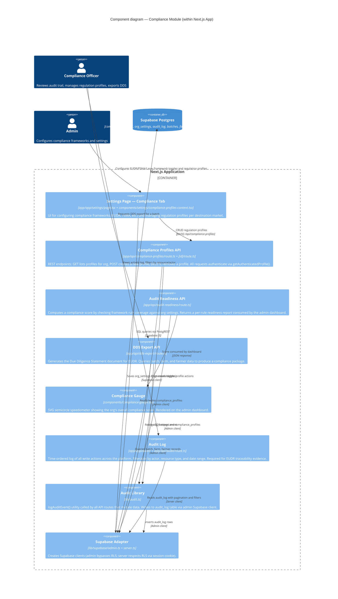

# C4 Level 3 — Components: Compliance Module

> Shows the internal structure of the compliance feature slice within the Next.js application.



## Compliance Framework Data Model

```
org_settings (jsonb columns per framework)
  enabled_frameworks[]          -- array of framework IDs
  eudr_deforestation_cutoff     -- bool
  eudr_geolocation_proof        -- bool
  gfl_supplier_traceability     -- bool
  ...

compliance_profiles
  id, org_id
  name, destination_market
  regulation_framework          -- EUDR | FSMA_204 | UK_Environment_Act | ...
  required_documents[]          -- string array
  geo_verification_level        -- basic | polygon | satellite
  min_traceability_depth        -- int (1–10)
  is_default                    -- bool

audit_log
  id, org_id, actor_id, actor_email
  action                        -- e.g. "batch.completed", "profile.created"
  resource_type, resource_id
  metadata (jsonb)
  created_at, ip_address
```

## Regulation Profile Templates

Six pre-built templates are defined in `components/settings/compliance-profiles-content.tsx` (`CP_TEMPLATES`):

| Key | Market | Framework |
|---|---|---|
| EU | European Union | EUDR |
| UK | United Kingdom | UK_Environment_Act |
| US_FSMA | United States | FSMA_204 |
| US_LACEY | United States | Lacey_Act_UFLPA |
| CN | China | China_Green_Trade |
| UAE | UAE / Middle East | UAE_Halal |
