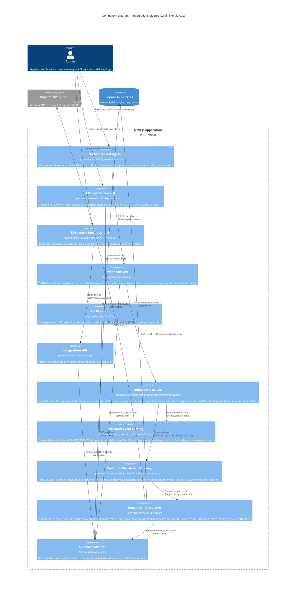

# C4 Level 3 — Components: Integrations Module

> Shows the internal structure of the integrations feature slice: webhooks, API keys, and the platform event pipeline.



## Platform Event Catalog (ADR-003)

All emittable event types are declared in `modules/integrations/domain/event-catalog.ts`.

**Batch lifecycle**: `batch.created`, `batch.updated`, `batch.completed`, `batch.dispatched`

**Farmer lifecycle**: `farmer.registered`, `farmer.updated`, `farmer.kyc_approved`, `farmer.kyc_rejected`

**Payment lifecycle**: `payment.initiated`, `payment.completed`, `payment.failed`, `payment.received`

**Shipment lifecycle**: `shipment.created`, `shipment.dispatched`, `shipment.delivered`, `shipment.cancelled`

**Compliance**: `compliance.profile_created`, `compliance.dds_exported`, `compliance.audit_flag`

**System**: `webhook.test`, `api_key.created`, `api_key.revoked`, `org.settings_updated`, `org.kyc_submitted`, `org.kyc_approved`, `org.kyc_rejected`

## Dispatch Payload Structure

```json
{
  "event": "batch.completed",
  "timestamp": "2026-04-11T10:00:00Z",
  "orgId": "uuid",
  "payload": { ... }
}
```

Each POST includes an `X-OriginTrace-Signature` header: `sha256=<HMAC-SHA256(secret, JSON body)>`.

## Migration Note

`lib/integrations/dispatcher.ts` is the legacy implementation. New code should call `emitEvent()` or `emitEventBackground()` from the application use-case. The gateway's dynamic import prevents circular dependencies during the migration window. Once migration is complete, direct imports of `dispatcher.ts` from outside `modules/integrations/infra/` should be removed.
