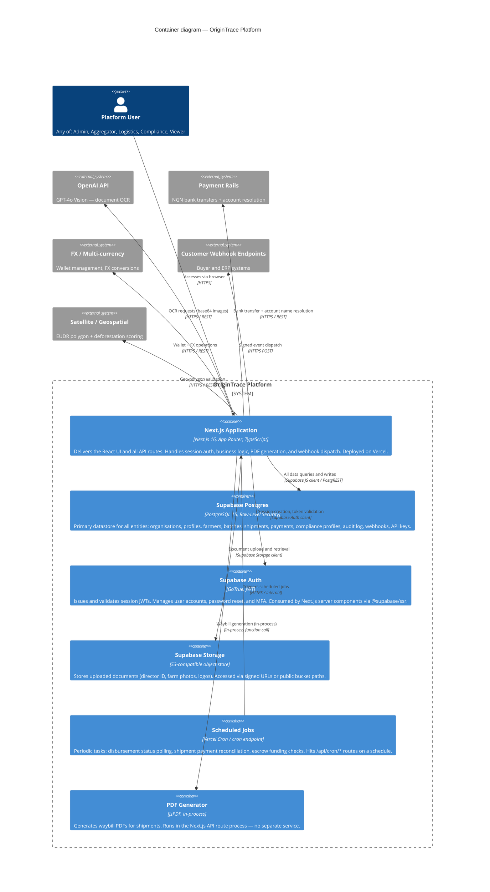

# C4 Level 2 — Containers

> Zooms into the OriginTrace platform boundary and shows the distinct deployable/runnable units.



## Container Responsibilities

| Container | Owns | Does NOT own |
|---|---|---|
| Next.js App | Route handling, auth middleware, business logic, PDF, webhook dispatch | Data durability, file storage, auth sessions |
| Supabase Postgres | All persistent state; RLS enforces org isolation | Application logic, HTTP transport |
| Supabase Auth | User identity, JWT lifecycle | Org roles/permissions (those live in `profiles` table) |
| Supabase Storage | Binary blobs (documents, images) | Metadata (paths stored in Postgres) |
| Cron | Periodic reconciliation triggers | Reconciliation logic itself (that's in API routes) |
| PDF Engine | Waybill layout + rendering | Waybill data (fetched from Postgres by the API route) |

## Data Flow: Batch → Disbursement

```
Aggregator creates batch → Postgres (batches)
  → Aggregator completes batch → status: completed
    → Disbursement calculation → Postgres (disbursement_calculations)
      → Admin approves → Payment Rail (bank transfer)
        → Cron polls status → Postgres (updated)
          → webhookTargets ← event: payment.received
```
