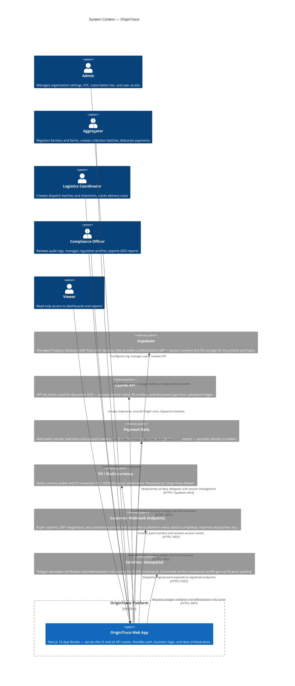

# C4 Level 1 — System Context

> Describes who uses OriginTrace and which external systems it depends on.

## Key Decisions

| Decision | Rationale |
|---|---|
| Single Next.js app for UI + API | Reduces operational complexity; no separate backend service to deploy or scale independently at this stage |
| Supabase for DB + Auth | Row-Level Security enforces org-level data isolation without application-layer tenant filters on every query |
| Provider branding hidden | All payment/FX providers are presented as "OriginTrace" — decouples the UX from vendor lock-in |
| Webhook event catalog (ADR-003) | Typed event strings prevent undocumented integrations from silently breaking customer pipelines |
